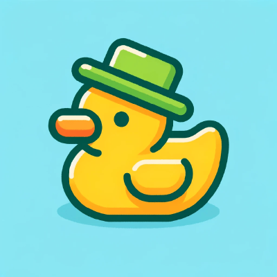

  <a href="README.md">English</a> | <b>🌍 Español</b>

  

    _Hola,+soy+Luis+Rigoberto;>_Software+Developer;" alt="Nombre" />
     
      <b>C | C++ | Java | Python | Rust | PHP</b>
  

<h1 align="center">Luis Rigoberto Ramírez Llamas</h1>

  <b>Software Developer | Systems & Algorithms | Hardware Integration</b> 
  Diseño y desarrollo de software eficiente, desde lógica algorítmica hasta aplicaciones de escritorio ligeras. 
  Actualmente cursando Ingeniería en Desarrollo de Software en el Tecnológico y de Estudios Superiores de Occidente (ITESO).

   &nbsp;
   &nbsp;
   &nbsp;
   &nbsp;
   &nbsp;
   &nbsp;
  

## Lo que hago

- Implementación de estructuras de datos y algoritmos complejos.
- Programación a bajo y alto nivel (desde C, C++ hasta Java/Python/PHP).
- Desarrollo de aplicaciones de escritorio ligeras y multiplataforma.
- Integración de sistemas de hardware y software.
- Resolución de problemas de lógica matemática y optimización.

## Stack Tecnológico

| Área | Tecnologías |
|------|--------------|
| Lenguajes | C • C++ • Java • Python • Rust • PHP • Bash |
| Frameworks / Tools | Tauri • Antigravity  • Amazon Web Services | 
| Intereses | Sistemas Distribuidos • Desarrollo Web y de Aplicaciones |

## Proyectos Destacados

### Traductor y Decodificador de Instrucciones RISC-V
C
- Sistema que lee código máquina en formato hexadecimal, lo convierte a binario y extrae los campos correspondientes a la arquitectura RISC-V.
- Implementa la identificación de opcodes y decodificación de formatos R, I, S, B, U y J, incluyendo el cálculo del valor inmediato (imm).
- Soporta la lectura de instrucciones directamente desde la terminal o mediante archivos externos.

### Gestor de Finanzas Personales
Java
- Aplicación para el control de gastos e ingresos, con enfoque en estructuras de datos eficientes.

### Sistema de Gestión de Pedidos
C++ • Algoritmia
- Integración del algoritmo de Dijkstra para optimización de rutas.
- Proyecto desarrollado durante la etapa como Tecnólogo en Desarrollo de Software (CETI).

## Logros y Competencias

**1er Lugar — Competencia de Programación Algorítmica Interna**  
Competencia institucional en ITESO, demostrando habilidades avanzadas en resolución de problemas bajo presión.

**2do Lugar (Cat. Discapacidad) / 3er Lugar General — Reto Maker**  
Diseño y desarrollo de un prototipo de brazo robótico con control neuronal, involucrando la innovación e integración de hardware/software.

## Contacto

- Ubicación: **Guadalajara, Jalisco, México**
- Email: **[rigo.llamas77@gmail.com](mailto:rigo.llamas77@gmail.com)**
- LinkedIn: **[Luis Rigoberto Ramírez Llamas](https://www.linkedin.com/in/luis-rigoberto-ramirez-llamas/)**

---

  
  
<i>"Rubber duck debugging en proceso. Resolviendo problemas de hardware y software paso a paso."</i>

